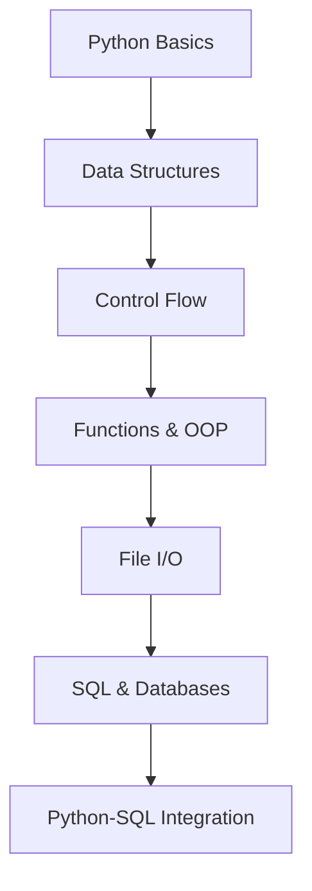
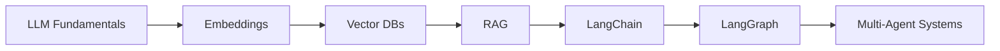
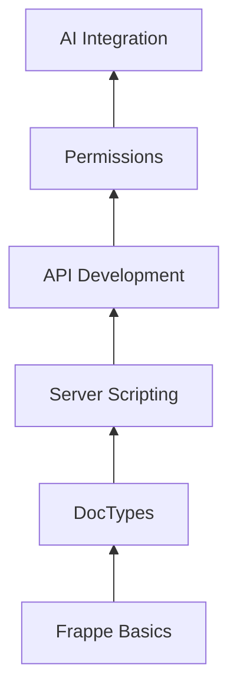

Based on the provided Mermaid diagram code, the error "Parse error on line 9: ...L Integration]\#\#\# Module 2: AI & LLM E" is likely caused by an unexpected sequence of characters. The diagram's syntax is being broken by the line `### Module 2: AI & LLM Ecosystem (Weeks 5-8)`, which is a Markdown heading. Mermaid diagrams cannot contain standard Markdown outside of the diagram's syntax block.

To fix this, the Mermaid code for each diagram block needs to be separated and enclosed within its own distinct `mermaid` block.

**Here is the corrected and properly formatted content:**

-----

# AI & Enterprise App Development with Python (12-Week Intensive)

Comprehensive training program covering **Python programming**, **AI/LLM integration**, and **enterprise application development** with Frappe Framework.

## 🚀 Program Overview

  - **Duration**: 12 weeks (3 hours/day, 5 days/week)
  - **Format**: Daily lectures (1h) + hands-on exercises (1h)
  - **Prerequisites**: Basic computer literacy
  - **Outcome**: Full-stack AI application development skills

## 📚 Curriculum Structure

### Module 1: Core Python & Data (Weeks 1-4)

**Foundations of Python programming and database integration**



### Module 2: AI & LLM Ecosystem (Weeks 5-8)

**Building AI applications with LangChain and RAG pipelines**



### Module 3: Enterprise Development (Weeks 9-12)

**Frappe Framework and AI integration for business applications**



# AI & Enterprise Application Development with Python

A comprehensive 12-week intensive program covering Python programming, AI/LLM integration, and enterprise application development with Frappe Framework.

## 🛠️ Technical Stack

### Core Technologies

| Category | Technologies |
|---|---|
| **Core Language** | Python 3.10+ |
| **AI Framework** | LangChain, LangGraph |
| **Vector Database** | ChromaDB |
| **Enterprise** | Frappe Framework |
| **Database** | PostgreSQL, SQLite |
| **Deployment** | Frappe Bench, Docker |

## 🎯 Key Learning Outcomes

  - **Python Mastery**: From syntax fundamentals to OOP and database integration
  - **AI Engineering**: Build RAG pipelines and multi-agent systems
  - **Enterprise Development**: Create production-ready business applications
  - **Full Integration**: Combine AI capabilities with enterprise systems

## 📂 Project Portfolio

By program completion, students will have built:

1.  **CLI Blog Manager**
    Python + SQL integration project

2.  **Conversational RAG Agent**
    LangChain-based question answering system

3.  **AI-Powered Library System**
    Frappe Framework integrated with LangChain

## 📅 Weekly Breakdown

| Week | Focus Area | Key Topics |
|---|---|---|
| 1 | Python Fundamentals | Syntax, Data Structures, Operators |
| 2 | Advanced Python | OOP, Modules, File I/O |
| 3 | Database Foundations | SQL, Python DB Integration |
| 4 | Python Project | CLI Blog Manager |
| 5 | AI Fundamentals | LLMs, RAG, Embeddings |
| 6 | Vector Databases | ChromaDB, Pinecone |
| 7 | LangChain | Chains, Agents, Tools |
| 8 | Multi-Agent Systems | LangGraph, Evaluation |
| 9 | Frappe Framework | DocTypes, UI Customization |
| 10 | Frappe Development | Server Scripting, APIs |
| 11 | Frappe Advanced | Permissions, Hooks |
| 12 | AI Integration | Frappe + LangChain Project |

## 🚀 Getting Started

1.  **Clone the repository**:

    ```bash
    git clone https://github.com/yourusername/ai-enterprise-dev.git
    cd ai-enterprise-dev
    ```

2.  **Set up environment**:

    ```bash
    python -m venv venv
    # Linux/Mac
    source venv/bin/activate
    # Windows
    venv\Scripts\activate
    pip install -r requirements.txt
    ```

3.  **Explore weekly materials**:

    ```
    /week-1-python-fundamentals
    /week-2-advanced-python
    ...
    /week-12-ai-integration
    ```

## 🤝 Contributing

We welcome contributions from the community\! To contribute, please follow these steps:

1.  **Fork** the repository
2.  **Create** your feature branch:
    `git checkout -b feature/your-feature-name`
3.  **Commit** your changes:
    `git commit -m 'Add some feature'`
4.  **Push** to the branch:
    `git push origin feature/your-feature-name`
5.  **Open** a Pull Request

## 📜 License

MIT License - see the [LICENSE](https://www.google.com/search?q=LICENSE) file for details.
